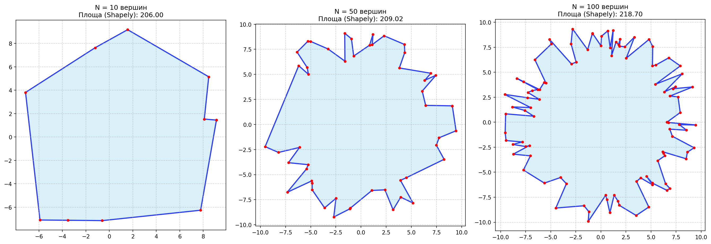
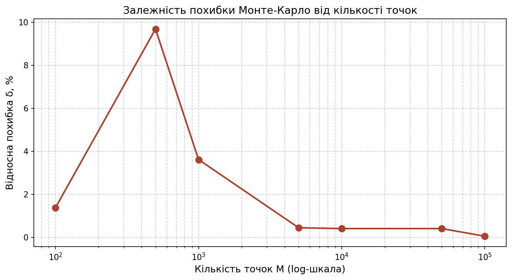
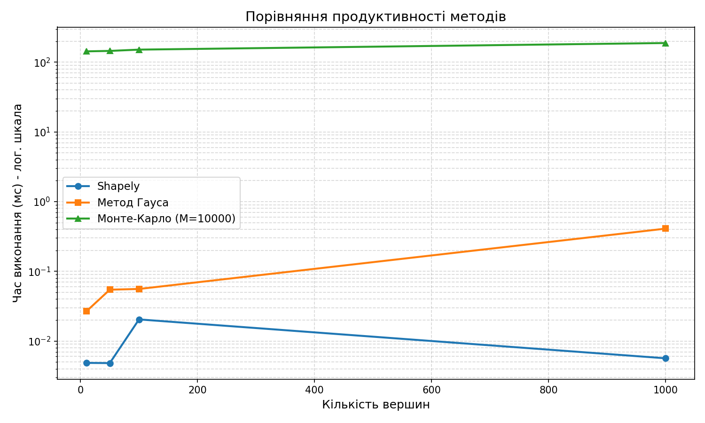

# Алгоритмічні та евристичні методи обчислення площі геометричних фігур
## Бучко Вікторія ІПЗ-4.02

---

## Мета

- Закріпити знання про геометричне представлення полігонів у памяті компютера
- Реалізувати точний (аналітичний) та наближений (імовірнісний) методи обчислення площі
- Провести порівняльний аналіз: метод Гауса (Shoelace formula) vs метод Монте-Карло
- Дослідити залежність точності та швидкодії від кількості вершин та кількості ітерацій

---

## 1. Підготовка та генерація

Створено проект, налаштовано віртуальне оточення та встановлено залежності:

```
pip install -r requirements.txt
```

Згенеровано три тестові полігони з різною кількістю вершин і збережено зображення:



*Рис. 1 - Згенеровані полігони з N=10, N=50 та N=100 вершинами*

---

## 2. Реалізація алгоритмів

Реалізовано два власні методи обчислення площі у файлі `algorithms.py`.

**Метод Гауса (Shoelace formula)** - аналітичний підхід, що обчислює площу через суму векторних добутків координат сусідніх вершин. Результат збігається з еталонним значенням Shapely з похибкою 0.000000%.

**Метод Монте-Карло** - імовірнісний підхід: у bounding box навколо полігону генерується M випадкових точок, і площа оцінюється як частка тих, що потрапили всередину, помножена на площу прямокутника. Для перевірки входження використовується `.contains()` бібліотеки Shapely.

Результати порівняння методів для трьох полігонів (M=10000):

| N вершин | Shapely    | Гаус       | Похибка Гауса | Монте-Карло | Похибка МК |
|----------|------------|------------|---------------|-------------|------------|
| 10       | 206.001760 | 206.001760 | 0.000000%     | 205.010169  | 0.48%      |
| 50       | 209.016336 | 209.016336 | 0.000000%     | 211.436617  | 1.16%      |
| 100      | 218.698340 | 218.698340 | 0.000000%     | 216.236764  | 1.13%      |

---

## 3. Дослідження точності методу Монте-Карло

Для полігону з N=50 вершин проведено серію експериментів зі збільшенням кількості точок M від 100 до 100000. Для кожного значення обчислено відносну похибку відносно еталонної площі Shapely.

| M      | Площа (МК) | Похибка (%) |
|--------|------------|-------------|
| 100    | 211.8882   | 1.3740      |
| 500    | 229.2561   | 9.6833      |
| 1000   | 201.4675   | 3.6116      |
| 5000   | 209.9430   | 0.4433      |
| 10000  | 208.1715   | 0.4042      |
| 50000  | 209.8596   | 0.4035      |
| 100000 | 208.9113   | 0.0502      |



*Рис. 2 - Залежність відносної похибки методу Монте-Карло від кількості точок M (вісь X - логарифмічна шкала)*

---

## 4. Аналіз продуктивності (Benchmark)

Виміряно час виконання всіх трьох методів на полігонах з різною кількістю вершин. Монте-Карло запускався один раз з M=10000, Shapely та Гаус - усереднено по 20 повторах.

| N вершин | Shapely (мс) | Гаус (мс) | Монте-Карло (мс) |
|----------|-------------|-----------|-----------------|
| 10       | 0.004045    | 0.024925  | 145.7147        |
| 50       | 0.003670    | 0.037765  | 145.5511        |
| 100      | 0.003825    | 0.059840  | 148.3760        |
| 1000     | 0.005490    | 0.394825  | 191.2120        |



*Рис. 3 - Час виконання трьох методів залежно від кількості вершин (вісь Y - логарифмічна шкала)*

---

## Висновки

**Порівняння швидкості:** Метод Гауса є оптимальним з практичної точки зору - він працює в десятки тисяч разів швидше за Монте-Карло і дає абсолютно точний результат. При N=1000 вершин Гаус виконується за 0.39 мс, тоді як Монте-Карло потребує ~191 мс. Shapely найшвидший завдяки реалізації на C++, проте час Гауса також залишається у межах мілісекунд навіть для складних полігонів.

**Точність Монте-Карло:** При малій кількості точок (M=500) похибка може сягати ~10%, що неприйнятно. Починаючи з M=10000 похибка стабілізується нижче 0.5%, а при M=100000 знижується до 0.05%. Для задач де достатня точність ~0.5%, оптимальним є M=10000 - це баланс між точністю та часом виконання.